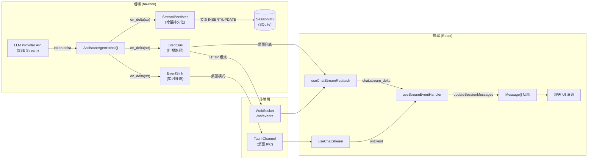
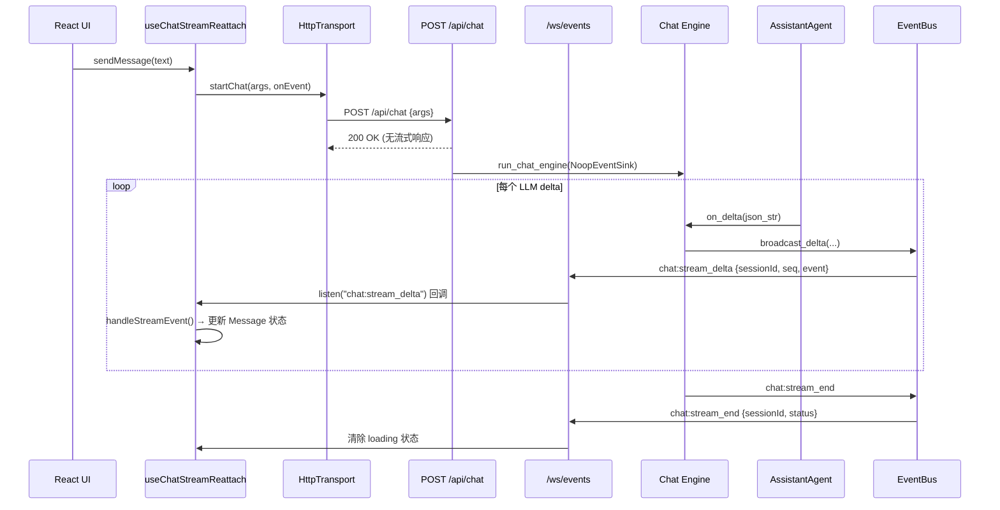

# LLM 返回数据处理与前后端交互技术文档

> 返回 [文档索引](../README.md) | 更新时间：2026-06-22

## 目录

- [概述](#概述)
- [端到端数据流总览](#端到端数据流总览)
- [后端：LLM 响应处理](#后端llm-响应处理)
  - [1. Chat Engine 入口与 Agent 构建](#1-chat-engine-入口与-agent-构建)
  - [2. on_delta 回调：流式增量的三路分发](#2-on_delta-回调流式增量的三路分发)
  - [3. StreamPersister：增量持久化](#3-streampersister增量持久化)
  - [4. EventSink：实时推送前端](#4-eventsink实时推送前端)
  - [5. EventBus 广播：双写与重载恢复](#5-eventbus-广播双写与重载恢复)
  - [6. 流式事件协议](#6-流式事件协议)
  - [7. 工具循环中的消息持久化](#7-工具循环中的消息持久化)
  - [8. Turn 完成后的收尾处理](#8-turn-完成后的收尾处理)
- [传输层：三种运行模式](#传输层三种运行模式)
  - [Tauri 桌面模式](#tauri-桌面模式)
  - [HTTP/Web 模式](#httpweb-模式)
  - [ACP stdio 模式](#acp-stdio-模式)
- [前端：Transport 抽象层](#前端transport-抽象层)
  - [Transport 接口设计](#transport-接口设计)
  - [TauriTransport 实现](#tauritransport-实现)
  - [HttpTransport 实现](#httptransport-实现)
  - [Transport 选择与切换](#transport-选择与切换)
- [前端：聊天流处理](#前端聊天流处理)
  - [useChatStream：主聊天 hook](#usechatstream主聊天-hook)
  - [useChatStreamReattach：EventBus 恢复路径](#usechatstreamreattacheventbus-恢复路径)
  - [useStreamEventHandler：事件分发与 UI 状态更新](#usestreameventhandler事件分发与-ui-状态更新)
  - [流式 Delta 缓冲与节流](#流式-delta-缓冲与节流)
  - [去重机制](#去重机制)
- [前端：消息渲染管线](#前端消息渲染管线)
- [崩溃恢复与一致性保障](#崩溃恢复与一致性保障)
- [关键数据结构速查](#关键数据结构速查)

---

## 概述

Hope Agent 的 LLM 返回数据处理是一个从 Provider HTTP SSE 响应到前端 UI 渲染的端到端流式管线，涵盖以下核心环节：

1. **后端流式解析**：`AssistantAgent::chat()` 调用 Provider API，通过 SSE 逐 token 接收 LLM 响应
2. **三路分发**：每个 delta 同时走 `StreamPersister`（持久化）、`EventSink`（实时推送前端）、`EventBus`（广播兜底与重载恢复）
3. **Transport 抽象**：前端通过统一的 `Transport` 接口消费流式事件，底层自动适配 Tauri IPC Channel 或 HTTP WebSocket
4. **前端流处理**：React Hook 层缓冲 delta、去重、节流刷新，将原始 JSON 事件映射为 `Message` + `ContentBlock` 状态
5. **消息渲染**：Markdown / Shiki 代码高亮 / KaTeX / Mermaid 渲染引擎将内容块转为可见 UI

---

## 端到端数据流总览



---

## 后端：LLM 响应处理

### 1. Chat Engine 入口与 Agent 构建

**入口函数**：[`crates/ha-core/src/chat_engine/engine.rs`](../../crates/ha-core/src/chat_engine/engine.rs) → `run_chat_engine(params: ChatEngineParams)`

Chat Engine 是所有对话请求的统一编排入口，接收 `ChatEngineParams` 参数包后执行以下步骤：

1. 参数解构 → 模型链/Provider/配置
2. Plan Context 解析 → Agent 工具限制
3. Codex OAuth Token 刷新
4. `StreamLifecycle` 创建（Drop 守卫保证 `stream_end` 一定发射）
5. `ChatSessionGuard` 创建（前台 idle gate，后台注入 yield 给前台 turn）
6. `SessionStart` / `UserPromptSubmit` hook 触发
7. IM Live Mirror attach（桌面/HTTP turn 可镜像到 IM）
8. 模型链遍历 → 对每个模型执行 `execute_with_failover`

在 `execute_with_failover` 的闭包内，核心调用链为：

```rust
// 1. 构建 Agent
let mut agent = build_agent_from_snapshot(model_ref, providers, ...).await?;
configure_agent(&mut agent, ...);
restore_agent_context(&db, &session_id, &agent);

// 2. 创建 StreamPersister
let persister = StreamPersister::new(db.clone(), session_id.clone(), source);
let persist_cb = persister.build_callback();

// 3. 调用 Agent.chat()，传入 on_delta 回调
agent.chat(&message, &attachments, effort, cancel, move |delta| {
    persist_cb(delta);                       // ① 持久化
    emit_stream_event_unchecked(             // ② + ③ 推送 + 广播
        &event_sink, &session_id, source, turn_id, delta,
    );
}).await
```

### 2. on_delta 回调：流式增量的三路分发

`on_delta` 闭包是整个流式管线的核心汇聚点。LLM 的每个 token delta、工具调用、工具结果都通过这个回调分发到三条路径：

| 路径 | 目标 | 作用 |
|------|------|------|
| ① `persist_cb(delta)` | StreamPersister | 增量写入 SQLite（placeholder 模型 + 节流 UPDATE） |
| ② `event_sink.send(enveloped)` | EventSink 实现 | 实时推送到前端（Tauri Channel 或 NoopSink） |
| ③ `broadcast_delta(...)` | EventBus | 广播 `chat:stream_delta`，供 WS 客户端和重载恢复消费 |

三路分发的精确顺序在 [`emit_stream_event_unchecked()`](../../crates/ha-core/src/chat_engine/engine.rs) 中：

```rust
fn emit_stream_event_unchecked(event_sink, session_id, source, turn_id, event) {
    // 1. 注入序号（快速字符串拼接，避免 serde 解析）
    let (enveloped, seq, stream_id) =
        stream_broadcast::inject_seq(session_id, event, turn_id);
    // 2. 发送到主 sink（Tauri Channel / NoopSink）
    event_sink.send(&enveloped);
    // 3. 广播到 EventBus（HTTP WS 客户端 + 重载恢复）
    stream_broadcast::broadcast_delta(session_id, &enveloped, seq, stream_id.as_deref());
    // 4. Fan-out 到 SinkRegistry（IM Live Mirror 等附加消费者）
    sink_registry::sink_registry().emit(session_id, &enveloped);
}
```

**关键设计**：[`inject_seq`](../../crates/ha-core/src/chat_engine/stream_broadcast.rs) 使用快速字符串拼接（找最后一个 `}` 前插入 `,"_oc_seq":N`），避免每个 delta 的 serde parse + re-serialize 开销。这在高频 token 流（~60 token/s）下性能优势显著。

### 3. StreamPersister：增量持久化

**源文件**：[`crates/ha-core/src/chat_engine/persister.rs`](../../crates/ha-core/src/chat_engine/persister.rs)

StreamPersister 实现了**崩溃安全的增量持久化模型**，核心设计是 **placeholder 模型 + 节流 UPDATE**：

```
首个 delta → INSERT placeholder（stream_status='streaming'，content=当前 buffer 快照）
后续 delta → 累积到内存 buffer；每 500ms 或 1KB UPDATE 一行
tool_call 边界 / turn 结束 → finalize（stream_status='completed'）
崩溃 → 残留 streaming 行，启动时标记为 orphaned
```

#### 事件处理分支

`StreamPersister::build_callback()` 返回的闭包按 `type` 字段分发：

| 事件类型 | 处理 |
|----------|------|
| `usage` | 更新 `CapturedUsage`（input_tokens, output_tokens, ttft_ms） |
| `thinking_delta` | 追加到 `pending_thinking` buffer → 触发 placeholder INSERT/节流 UPDATE |
| `text_delta` | 追加到 `pending_text` buffer → 触发 placeholder INSERT/节流 UPDATE |
| `tool_call` | `finalize_active_placeholder()` → INSERT 新 `role=tool` 行（result 为空） |
| `tool_result` | 通过 `call_id` 匹配 UPDATE 已有 tool 行的 result/duration/is_error/metadata/media_items |
| `context_compacted` | 仅 Tier ≥ 2 且非 start marker 时 INSERT event 行 |
| `round_limit_reached` | INSERT event 行 |

#### 节流机制

```rust
const FLUSH_INTERVAL: Duration = Duration::from_millis(500);
const FLUSH_BYTES: usize = 1024;

fn handle_text_chunk(&self, role, text) {
    // 1. 角色切换时先 finalize 前一个 placeholder
    // 2. 首个 chunk → begin_placeholder（INSERT）
    // 3. 后续 chunk → 积累 bytes_since_flush + 检查 elapsed
    //    任一阈值命中 → flush_active_placeholder（UPDATE）
}
```

#### 失败尝试的行管理

`owned_partial_message_ids` 跟踪本次尝试创建的所有行。failover 重试时：

- 成功 → `discard_failed_attempt_partial()` 删除前次失败的行
- 失败但有 visible partial → `store_failed_attempt_partial()` 保留行（供 finalize 重建 partial blocks）
- 失败且无 visible partial → `discard_attempt_rows()` 立即删除

### 4. EventSink：实时推送前端

**三种实现**：

| 实现 | 位置 | 消费场景 |
|------|------|----------|
| `ChannelSink` | [`src-tauri/src/commands/chat.rs`](../../src-tauri/src/commands/chat.rs) | 桌面 GUI 直连，包裹 `tauri::ipc::Channel<String>` |
| `NoopEventSink` | [`crates/ha-core/src/chat_engine/types.rs`](../../crates/ha-core/src/chat_engine/types.rs) | HTTP/Cron/Subagent，丢弃所有事件；真正的流式交付走 EventBus 双写 |
| `ChannelStreamSink` | [`crates/ha-core/src/chat_engine/types.rs`](../../crates/ha-core/src/chat_engine/types.rs) | IM 渠道，双路：EventBus `channel:stream_delta` + mpsc 转 IM 消息编辑任务 |

```rust
pub trait EventSink: Send + Sync + 'static {
    fn send(&self, event: &str);
}
```

### 5. EventBus 广播：双写与重载恢复

**源文件**：[`crates/ha-core/src/chat_engine/stream_broadcast.rs`](../../crates/ha-core/src/chat_engine/stream_broadcast.rs)

每个 delta 在发送到主 EventSink 的同时，也通过 EventBus 广播，实现以下功能：

- **HTTP 模式主路径**：`NoopEventSink` 丢弃事件，浏览器通过 `/ws/events` 订阅 `chat:stream_delta`
- **桌面模式兜底**：前端重载时 Channel 断开，通过 `transport.listen("chat:stream_delta")` 恢复
- **多窗口/跨设备**：多个客户端可独立消费同一会话的流

广播 payload 格式：

```json
{
  "sessionId": "sess-xxx",
  "seq": 42,
  "streamId": "stream-xxx",
  "event": "{\"type\":\"text_delta\",\"content\":\"Hello\"}"
}
```

`seq` 由 [`stream_seq.rs`](../../crates/ha-core/src/chat_engine/stream_seq.rs) 维护的 per-session 递增计数器生成，前端用 `_oc_seq` 字段去重。

### 6. 流式事件协议

所有事件通过 `EventSink.send()` 以 JSON 字符串形式推送：

| type | 关键字段 | 说明 |
|------|----------|------|
| `text_delta` | `content` | 文本增量（注意：字段名是 `content`，不是 `text`） |
| `thinking_delta` | `content` | 思考内容增量 |
| `tool_call` | `call_id`, `name`, `arguments` | 工具调用发起 |
| `tool_result` | `call_id`, `result`, `duration_ms`, `is_error`, `tool_metadata`, `media_items` | 工具执行结果 |
| `usage` | `input_tokens`, `output_tokens`, `model`, `ttft_ms`, `duration_ms` | Token 用量和性能指标 |
| `model_fallback` | `model`, `from_model`, `provider_id`, `model_id`, `reason`, `attempt`, `total`, `error` | 模型降级通知 |
| `context_compaction_progress` | `data.phase`, `data.kind` | 压缩进度（live-only，不持久化） |
| `context_compacted` | `data.tier_applied`, `data.tokens_before`, `data.tokens_after`, ... | 压缩完成（Tier ≥ 2 持久化） |
| `codex_auth_expired` | `error` | Codex OAuth Token 过期 |
| `profile_rotation` | `provider_id`, `model_id`, `from_profile`, `to_profile`, `reason` | Auth Profile 轮换 |
| `tool_call_args_rewritten` | `call_id`, `arguments` | PreToolUse hook 改写工具参数 |
| `round_limit_reached` | — | 工具循环达到轮次上限 |

每个事件在推送到前端前被注入 `_oc_seq`、`_oc_stream_id`、`_oc_turn_id` 元数据：

```json
{
  "type": "text_delta",
  "content": "Hello",
  "_oc_seq": 42,
  "_oc_stream_id": "stream-xxx",
  "_oc_turn_id": "turn-xxx"
}
```

### 7. 工具循环中的消息持久化

在 Agent 的工具循环中，消息持久化按以下节奏执行：

1. **Round 边界**：每个 tool round 结束后，`persist_round_context()` 将 `conversation_history` 同步回写 `sessions.context_json`
2. **Tool Call**：`StreamPersister` INSERT 一行 `role=tool` 消息（result 为空）
3. **Tool Result**：通过 `call_id` 匹配 UPDATE 已有 tool 行，填充 result、duration、is_error、metadata
4. **Thinking/Text 切换**：`finalize_active_placeholder()` 将前一个角色（如 thinking）的 placeholder 翻为 completed，再为新角色（如 text）开新 placeholder

### 8. Turn 完成后的收尾处理

Turn 正常完成后，Chat Engine 执行以下收尾步骤：

1. 发射 `usage` 事件（含 `duration_ms`）
2. `flush_remaining_thinking()` 刷新剩余 thinking buffer
3. 构建 assistant 消息（含 usage 元数据）→ INSERT
4. `save_agent_context()` → 保存 `context_json`
5. Finalize IM live mirror（后台 spawn，不阻塞 GUI）
6. `finish_chat_turn_after_execution()` → 更新 `chat_turns` 状态
7. `StreamLifecycle.finish()` → 广播 `chat:stream_end`
8. Post-turn effects（后台 spawn，不阻塞）：
   - 自动会话标题
   - 记忆提取（四道门控：auto_extract / 非手动保存 / 冷却保护 / 内容阈值）
   - Skill auto-review

---

## 传输层：三种运行模式

### Tauri 桌面模式

```mermaid
sequenceDiagram
    participant UI as React UI
    participant Hook as useChatStream
    participant Transport as TauriTransport
    participant IPC as Tauri IPC Channel
    participant Chat as Chat Engine
    participant Agent as AssistantAgent

    UI->>Hook: sendMessage(text)
    Hook->>Transport: startChat(args, onEvent)
    Transport->>IPC: invoke("chat", {args, onEvent: Channel&lt;string&gt;})
    IPC->>Chat: run_chat_engine()

    loop 每个 LLM delta
        Agent->>Chat: on_delta(json_str)
        Chat->>IPC: event_sink.send(enveloped)
        Chat->>EventBus: broadcast_delta(sessionId, enveloped, seq, streamId)
        IPC->>Hook: onEvent(enveloped)
        Hook->>Hook: handleStreamEvent() → 更新 Message 状态
    end

    Chat->>IPC: chat:stream_end
    Hook->>UI: 清除 loading 状态
```

**关键点**：

- 主路径是 per-call `Channel<string>`，事件直接推送到 WebView
- EventBus `chat:stream_delta` 作为兜底路径（前端重载恢复用）
- `ChannelSink` 在 [`src-tauri/src/commands/chat.rs`](../../src-tauri/src/commands/chat.rs) 中包裹 `tauri::ipc::Channel`

### HTTP/Web 模式



**关键点**：

- 主路径是 EventBus → `/ws/events` → 前端 `listen()` 订阅
- `startChat` 的 `POST /api/chat` 只返回 HTTP 状态码，不承载流式数据
- 唯一的 `onEvent` 合成事件是 `session_created`（新会话时通知前端做 cache rename）
- WS 鉴权通过 `?token=<api_key>` query 参数（浏览器 WebSocket 无法设置自定义 Header）
- Server 端每个 WS 连接持有独立 broadcast receiver，5s 发送超时断开慢客户端

### ACP stdio 模式

ACP 模式通过 NDJSON over stdio 直连 `ha-core::acp` 协议层，**不经过前端 Transport**，不加载 React。数据流是 Agent ↔ stdio ↔ IDE 客户端。Agent turn 边界自建 `ChatSessionGuard`。

---

## 前端：Transport 抽象层

### Transport 接口设计

**源文件**：[`src/lib/transport.ts`](../../../src/lib/transport.ts)

Transport 定义了前端与后端通信的三个原语：

```typescript
export interface Transport {
  call<T>(command: string, args?: Record<string, unknown>): Promise<T>;
  startChat(args: ChatStartArgs, onEvent: (event: string) => void): Promise<string>;
  listen(eventName: string, handler: (payload: unknown) => void): () => void;
  // ... 媒体解析、文件操作、导出等辅助方法
}
```

| 原语 | 语义 | Tauri 实现 | HTTP 实现 |
|------|------|-----------|----------|
| `call` | 请求/响应 | `invoke(command, args)` | 查 `COMMAND_MAP` → REST 调用 |
| `startChat` | 启动一轮对话 | 创建 `Channel<string>` + `invoke("chat", ...)` | `POST /api/chat`，流式 delta 走 EventBus |
| `listen` | 订阅后端事件 | `@tauri-apps/api/event.listen` | 复用全局 `/ws/events` WebSocket |

### TauriTransport 实现

**源文件**：[`src/lib/transport-tauri.ts`](../../../src/lib/transport-tauri.ts)

`startChat` 实现：

```typescript
async startChat(args, onEvent): Promise<string> {
  const channel = new Channel<string>();
  channel.onmessage = onEvent;           // 每个 stream event 直接到 onEvent
  return invoke("chat", { ...args, onEvent: channel });
}
```

`listen` 实现：

```typescript
listen(eventName, handler): () => void {
  const unlisten = await listenTauri(eventName, (event) => handler(event.payload));
  return unlisten;
}
```

### HttpTransport 实现

**源文件**：[`src/lib/transport-http.ts`](../../../src/lib/transport-http.ts)

`startChat` 实现：

```typescript
async startChat(args, onEvent): Promise<string> {
  const response = await fetch(`${baseUrl}/api/chat`, {
    method: "POST",
    headers: { "Content-Type": "application/json", "Authorization": `Bearer ${apiKey}` },
    body: JSON.stringify(args),
  });
  // 流式 delta 不进 onEvent，走 /ws/events → chat:stream_delta
  // 仅新会话时合成 session_created 事件
  if (response.session_created) {
    onEvent(JSON.stringify({ type: "session_created", session_id: response.session_id }));
  }
  return response.response || "";
}
```

`listen` 实现：

```typescript
listen(eventName, handler): () => void {
  ensureWsConnection();                   // 确保 WebSocket 已连接
  const id = addListener(eventName, handler);  // 注册 listener
  return () => removeListener(id);        // 返回 unsubscribe 函数
}
```

WebSocket 生命周期：

- 首个 listener 注册时建立连接
- 最后一个 listener 取消时关闭连接
- 断线后按 1s → 2s → 4s → ... → 30s 上限指数退避重连

### Transport 选择与切换

**源文件**：[`src/lib/transport-provider.ts`](../../../src/lib/transport-provider.ts)

```typescript
export function getTransport(): Transport {
  if (isTauriMode()) return new TauriTransport();
  else return new HttpTransport(baseUrl, apiKey);
}
```

`isTauriMode()` 检查 `window.__TAURI_INTERNALS__`（Tauri 在用户脚本前注入的运行时标记）。

运行时切换：

- `switchToRemote(baseUrl, apiKey)` → 切到远程 HttpTransport
- `switchToEmbedded()` → 切回默认入口

---

## 前端：聊天流处理

### useChatStream：主聊天 hook

**源文件**：[`src/components/chat/hooks/useChatStream.ts`](../../../src/components/chat/hooks/useChatStream.ts)

`useChatStream` 是桌面模式下聊天流的主入口，职责：

1. **发送消息**：调用 `transport.startChat(args, onEvent)`
2. **处理 onEvent**：解析 JSON 事件 → 调用 `handleStreamEvent()` 更新 UI 状态
3. **管理加载状态**：`loadingSessionsRef` 跟踪哪些会话正在流式输出
4. **处理审批**：`useApprovals` hook 管理工具审批弹窗
5. **通知**：后台完成时发送桌面通知
6. **新会话创建**：`__pending__` cache rename 机制

### useChatStreamReattach：EventBus 恢复路径

**源文件**：[`src/components/chat/hooks/useChatStreamReattach.ts`](../../../src/components/chat/hooks/useChatStreamReattach.ts)

`useChatStreamReattach` 通过 `transport.listen("chat:stream_delta", ...)` 订阅 EventBus 路径，承担两种角色：

| 运行模式 | 角色 |
|----------|------|
| Tauri 桌面 | 兜底路径——主 Channel 断开时（前端重载）接管流式更新 |
| HTTP/Web | **主路径**——所有流式 delta 都从这里到达 |

核心流程：

```typescript
export function useChatStreamReattach(deps) {
  useEffect(() => {
    const unsub = transport.listen("chat:stream_delta", (payload) => {
      // 1. 提取 payload.sessionId / payload.seq / payload.event
      // 2. 按 _oc_seq 去重（与 useChatStream 共享 lastSeqRef）
      // 3. 解析内层 event JSON
      // 4. 调用 handleStreamEvent() 更新 UI 状态
    });

    const unsubEnd = transport.listen("chat:stream_end", (payload) => {
      // 清除 loading 状态，记录 ended stream id
      // 最终重拉最新消息兜底
    });
  }, [currentSessionId]);
}
```

**自愈机制**：如果 `chat:stream_end` 事件丢失，15 秒定时器检查后端 `get_session_stream_state`，确认非 active 后清除 loading 标记。清除前等待 2 秒二次确认，避免误杀刚启动的 turn。

### useStreamEventHandler：事件分发与 UI 状态更新

**源文件**：[`src/components/chat/hooks/useStreamEventHandler.ts`](../../../src/components/chat/hooks/useStreamEventHandler.ts)

`handleStreamEvent()` 是所有流式事件的统一处理函数，将原始 JSON 事件映射为 React `Message[]` 状态更新：

| 事件类型 | UI 状态更新 |
|----------|------------|
| `text_delta` / `thinking_delta` | 缓冲到 `pendingDeltas`，调度 rAF 节流刷新 |
| `tool_call` | 先 flush 缓冲；在 `assistant.toolCalls` push 新条目；在 `contentBlocks` push `{type: "tool_call"}` |
| `tool_result` | 通过 `call_id` 匹配 `toolCalls` 中已有条目，填充 result / durationMs / isError / mediaItems / metadata |
| `tool_call_args_rewritten` | 通过 `call_id` 找到已有 tool block，原地替换 arguments |
| `usage` | 更新 `assistant.usage` / `assistant.model` |
| `model_fallback` | 更新 `assistant.fallbackEvent` |
| `context_compacted` / `context_compaction_progress` | Tier < 2 忽略；Tier ≥ 2 INSERT/原地更新 event 行 |
| `codex_auth_expired` | 设置 `showCodexAuthExpired` 状态 |
| `profile_rotation` / `thinking_auto_disabled` / `vision_auto_disabled` | INSERT event 行 |
| `round_limit_reached` | INSERT event 行 |

### 流式 Delta 缓冲与节流

`text_delta` 和 `thinking_delta` 不直接更新 React 状态，而是缓冲到 `StreamDeltaBuffers` 后通过 `requestAnimationFrame` 节流刷新：

```
delta 到达 → 累积到 pending.text / pending.thinking
            → 调度 rAF（如果尚未调度）
rAF 触发   → 检查距上次 flush 是否 ≥ 33ms（~30fps）
              如果是 → flushPendingStreamDeltas()
              如果否 → 重新调度 rAF（等待下一帧）
```

**设计理由**：每个 delta flush 触发末块 markdown re-lex + Shiki 重高亮 + React reconcile。在高频 token 流下直接每帧 flush 会导致 CPU 峰值。降到 ~30fps 后视觉几乎无感（字符 fadeIn 动画补帧），CPU 减半。

**尾部补偿**：`stream_end` 到达时会抢跑 flush，可能丢弃最后一帧 delta。这些丢失的 delta 由 `mergeMessagesByDbId` 的 DB 终态重对账补回。

### 去重机制

前端 `lastSeqRef` 是 `Map<sessionId, number>`，由 `useChatStream` 和 `useChatStreamReattach` 共享：

- 两条路径（Channel 和 EventBus）可能同时看到同一事件
- 哪条路径先处理事件就推进 cursor
- 后到的路径看到 `_oc_seq ≤ lastSeq` 则跳过

切换会话时，前端读取 `get_session_stream_state` 获取后端 cursor，给 `lastSeqRef` 播种，避免把 DB 快照里已有的 delta 再播一遍。

---

## 前端：消息渲染管线

```
Message 状态
  ├─ role: "user"     → UserBubble（Markdown + 附件卡片）
  ├─ role: "assistant"
  │   ├─ contentBlocks: ContentBlock[]
  │   │   ├─ {type: "text"}           → Streamdown（Markdown + Shiki + KaTeX + Mermaid）
  │   │   ├─ {type: "thinking"}       → ThinkingBlock（可折叠思考过程）
  │   │   └─ {type: "tool_call"}      → ToolCallBlock
  │   │       ├─ 未完成               → Loading spinner + 工具名
  │   │       └─ 已完成 (tool.result) → 工具名 + 可展开结果面板
  │   ├─ toolCalls: ToolCall[]        → 工具调用摘要
  │   ├─ usage: UsageInfo             → Token 用量显示
  │   └─ fallbackEvent: FallbackEvent → 模型降级横幅
  └─ role: "event"    → EventBanner（压缩通知、轮换通知等）
```

渲染管线关键组件：

- **Streamdown**：自定义 Markdown 渲染器，支持流式增量更新（仅 re-lex 末块），Shiki 代码高亮、KaTeX 数学、Mermaid 图表
- **ToolCallBlock**：工具调用卡片，显示工具名、参数、结果、耗时、媒体附件
- **ThinkingBlock**：可折叠的思考过程展示
- **ContextCompactionBanner**：上下文压缩进度/完成横幅（原地更新，不追加新行）

---

## 崩溃恢复与一致性保障

系统通过三层机制保证崩溃后数据不丢失：

### 1. Round-level context_json 同步

每个 tool round 结束后，`persist_round_context()` 将 `conversation_history` 整体覆盖写回 `sessions.context_json`。已完成的 round 永远在盘上。

### 2. messages 表 streaming placeholder + 节流 UPDATE

- 首个 delta INSERT placeholder（`stream_status='streaming'`）
- 每 500ms / 1KB UPDATE
- 崩溃后残留 `streaming` 行，启动时 `mark_orphaned_streaming_rows()` 批量标记为 `orphaned`

### 3. 启动扫尾 + restore 时摘要注入

- `init_runtime` 后调 `mark_orphaned_streaming_rows()`
- `restore_agent_context` 调 `inject_orphaned_partial_summary`：扫描末尾 orphaned 行，拼成 `[系统事件] 上一轮在生成中被中断…` 注入 history
- 注入后 `save_agent_context` 落盘，避免重复注入

### 4. 信号处理器与 panic hook

- SIGTERM/SIGINT → 写 clean marker → finalize 所有 active turn → flush 所有 persister → exit(0)
- panic → 杀整个进程组 → **不写** marker（下次启动按 Crash 处理）

---

## 关键数据结构速查

### 后端

| 结构 | 文件 | 说明 |
|------|------|------|
| `ChatEngineParams` | [`chat_engine/types.rs`](../../crates/ha-core/src/chat_engine/types.rs) | 完整请求参数包 |
| `ChatEngineResult` | [`chat_engine/types.rs`](../../crates/ha-core/src/chat_engine/types.rs) | 响应结果（response + agent） |
| `CapturedUsage` | [`chat_engine/types.rs`](../../crates/ha-core/src/chat_engine/types.rs) | Token 用量 + TTFT |
| `StreamPersister` | [`chat_engine/persister.rs`](../../crates/ha-core/src/chat_engine/persister.rs) | 流式增量持久化器 |
| `CompactResult` | [`context_compact/types.rs`](../../crates/ha-core/src/context_compact/types.rs) | 压缩操作结果 |
| `RuntimeLedgerSnapshot` | [`context_compact/ledger.rs`](../../crates/ha-core/src/context_compact/ledger.rs) | 运行时快照（jobs/subagents） |
| `CompactionManifest` | [`context_compact/manifest.rs`](../../crates/ha-core/src/context_compact/manifest.rs) | 压缩可观测性 payload |
| `ChatSource` | [`chat_engine/stream_seq.rs`](../../crates/ha-core/src/chat_engine/stream_seq.rs) | 流入口标识（Desktop/Http/Channel/Subagent/ParentInjection） |
| `StreamLifecycle` | [`chat_engine/engine.rs`](../../crates/ha-core/src/chat_engine/engine.rs) | Drop 守卫，保证 stream_end 一定发射 |

### 前端

| 类型 | 文件 | 说明 |
|------|------|------|
| `Transport` | [`src/lib/transport.ts`](../../../src/lib/transport.ts) | 通信抽象接口 |
| `ChatStartArgs` | [`src/lib/transport.ts`](../../../src/lib/transport.ts) | 聊天启动参数 |
| `Message` | [`src/types/chat.ts`](../../../src/types/chat.ts) | 消息模型（role, content, contentBlocks, toolCalls, usage） |
| `ContentBlock` | [`src/types/chat.ts`](../../../src/types/chat.ts) | 内容块（text/thinking/tool_call） |
| `StreamDeltaBuffers` | [`useStreamEventHandler.ts`](../../../src/components/chat/hooks/useStreamEventHandler.ts) | 流式 delta 缓冲 |
| `SessionStreamState` | [`useChatStreamReattach.ts`](../../../src/components/chat/hooks/useChatStreamReattach.ts) | 后端流状态快照 |

### 数据库

| 表/字段 | 说明 |
|---------|------|
| `sessions.context_json` | 完整对话历史（序列化 JSON） |
| `messages` 表 | 逐条消息行，含 `stream_status`（streaming/completed/orphaned） |
| `chat_turns` 表 | Turn 生命周期（running/cancelling/completed/interrupted/failed） |
